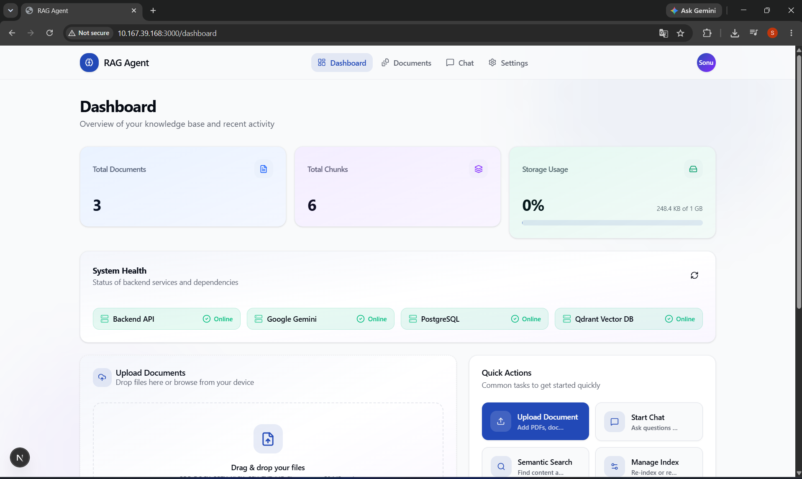
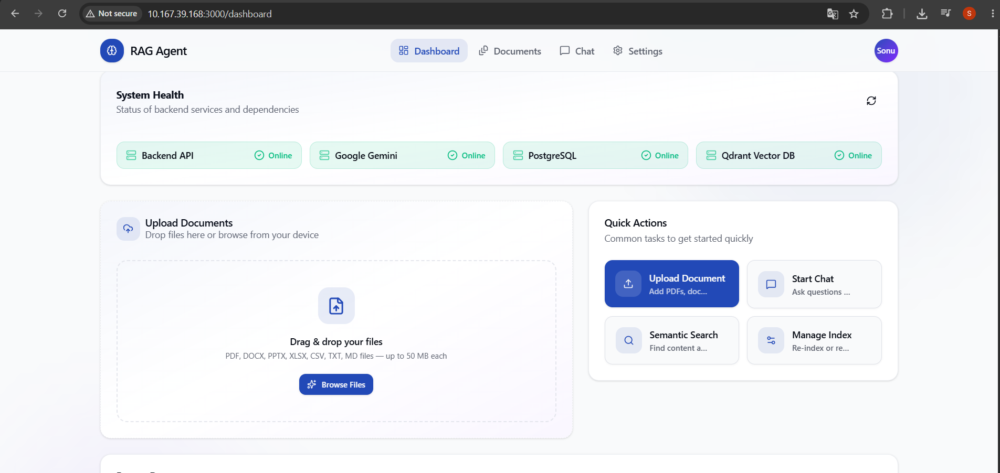
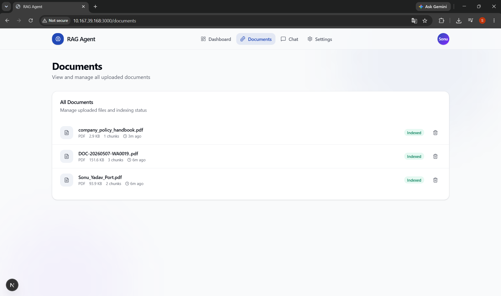
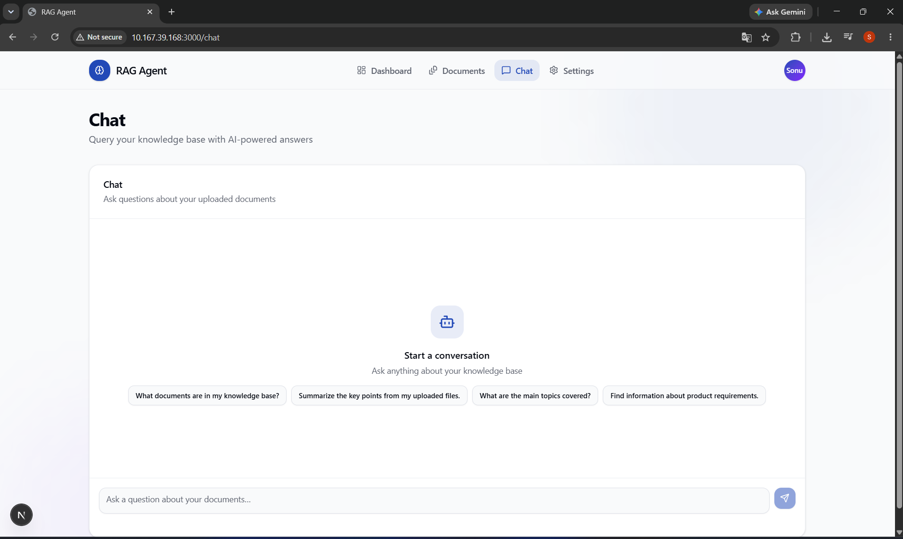

<div align="center">

# 🚀 Production-Grade RAG Agent

### Enterprise-Grade Retrieval-Augmented Generation (RAG) Platform

Build AI-powered knowledge assistants capable of ingesting, indexing, retrieving, and reasoning over your documents using **Google Gemini**, **LangGraph**, **FastAPI**, **Next.js**, **PostgreSQL**, and **Qdrant**.

<p>


</p>

</div>

---

# 📖 Overview

Production RAG Agent is a full-stack enterprise-ready Retrieval-Augmented Generation (RAG) system designed to build intelligent AI assistants over private documents.

Instead of relying only on an LLM's internal knowledge, the application retrieves relevant information from your uploaded documents using semantic search, injects that context into the prompt, and generates grounded responses with source citations.

The project emphasizes production engineering practices including resilient document ingestion, deterministic chunking, duplicate detection, retry handling, crash recovery, and scalable vector search.

---

# ⭐ Highlights

- Enterprise-grade RAG Architecture
- Multi-format Document Ingestion
- Google Gemini Integration
- LangGraph-based AI Pipeline
- FastAPI Backend
- Next.js + TypeScript Frontend
- PostgreSQL Metadata Storage
- Qdrant Vector Database
- Adaptive Semantic Chunking
- Duplicate Document Detection
- Resume-safe Indexing
- Streaming AI Chat
- Source Citations
- Docker Deployment
- Production Health Monitoring

---

# ✨ Features

## 📂 Document Processing

Supports uploading and indexing:

- PDF
- DOCX
- PPTX
- XLSX
- CSV
- TXT
- Markdown

Each uploaded document is automatically:

- Validated
- Parsed
- Chunked
- Embedded
- Indexed
- Stored

---

## 🧠 Adaptive Semantic Chunking

Production-friendly chunking pipeline featuring:

- Recursive chunk splitting
- Configurable chunk size
- Chunk overlap
- Deterministic Chunk IDs
- Duplicate detection
- Resume interrupted indexing

---

## 🤖 Retrieval-Augmented Generation

Instead of sending the whole document to the LLM:

1. User asks a question.
2. Semantic search retrieves relevant chunks.
3. LangGraph constructs context.
4. Google Gemini generates grounded answers.
5. Sources are returned alongside the response.

---

## ⚡ Resilient Embedding Pipeline

Designed to work reliably with external AI providers.

Features include:

- Dynamic Batch Sizing
- Exponential Backoff
- Retry with Jitter
- Adaptive Batch Reduction
- Concurrency Control
- Duplicate-safe Processing

> **Note:** When using the Google Gemini Free Tier, very large documents may require several minutes to finish embedding due to provider quota limits. Background asynchronous processing is planned in a future release.

---

## 💬 AI Chat

Supports:

- Conversational RAG
- Streaming Responses
- Markdown Rendering
- Code Blocks
- Copy Response
- Source Citations

---

## 📁 Document Management

- Upload Documents
- Delete Documents
- Duplicate Detection
- Already Indexed Detection
- Chunk Statistics
- Document Metadata

---

## 📊 Dashboard

Real-time monitoring for:

- Backend API
- Google Gemini
- PostgreSQL
- Qdrant
- Document Count
- Chunk Count
- Storage Usage

---

# 🏗 Architecture

```
                     User
                       │
                       ▼
             Next.js Frontend
                       │
             REST / Streaming API
                       │
                       ▼
               FastAPI Backend
                       │
       ┌───────────────┼───────────────┐
       │               │               │
       ▼               ▼               ▼
 Google Gemini     PostgreSQL      Qdrant
      │             Metadata     Vector Store
      └───────────────┬───────────────┘
                      ▼
                 LangGraph RAG
```

---

# ⚙ Technology Stack

## Frontend

- Next.js
- React
- TypeScript
- Tailwind CSS

## Backend

- FastAPI
- LangGraph
- SQLAlchemy
- Pydantic

## AI

- Google Gemini
- Semantic Embeddings
- Retrieval-Augmented Generation

## Databases

- PostgreSQL
- Qdrant Vector Database

## DevOps

- Docker
- Docker Compose

---

# 📸 Application Preview

## Dashboard

> 

---

## Upload Documents

> 

---

## Documents

> 

---

## AI Chat

> 

---

# 📂 Project Structure

```
Production-RAG-Agent/

├── app/
├── backend/
│   ├── app/
│   ├── services/
│   ├── api/
│   ├── docker-compose.yml
│   └── requirements.txt
│
├── components/
├── lib/
├── public/
├── package.json
├── next.config.ts
└── README.md
```

---

# 🔥 Production Engineering Features

✅ Deterministic Chunk IDs

✅ Duplicate Document Detection

✅ Resume Interrupted Indexing

✅ Adaptive Batch Embedding

✅ Exponential Backoff & Retry

✅ Dynamic Batch Reduction

✅ Similarity Threshold Filtering

✅ Streaming Responses

✅ Health Monitoring

✅ Dockerized Deployment

---


# 🎯 Learning Objectives

This project demonstrates practical experience with:

- Retrieval-Augmented Generation (RAG)
- AI Engineering
- Vector Databases
- Semantic Search
- LangGraph Workflows
- Google Gemini APIs
- Production FastAPI Development
- Full Stack AI Applications
- Docker Deployment
- Enterprise Software Architecture


# 📄 License

This project is licensed under the MIT License.

---

# 👨‍💻 Author

## Sonu Yadav

**AI Automation Engineer | AI Agent Developer | GenAI Engineer**

### Tech Stack

- Python
- FastAPI
- LangGraph
- Next.js
- TypeScript
- PostgreSQL
- Qdrant
- Docker
- Google Gemini
- n8n Automation

---

<div align="center">

⭐ If you found this project useful, please consider giving it a Star.

</div>
